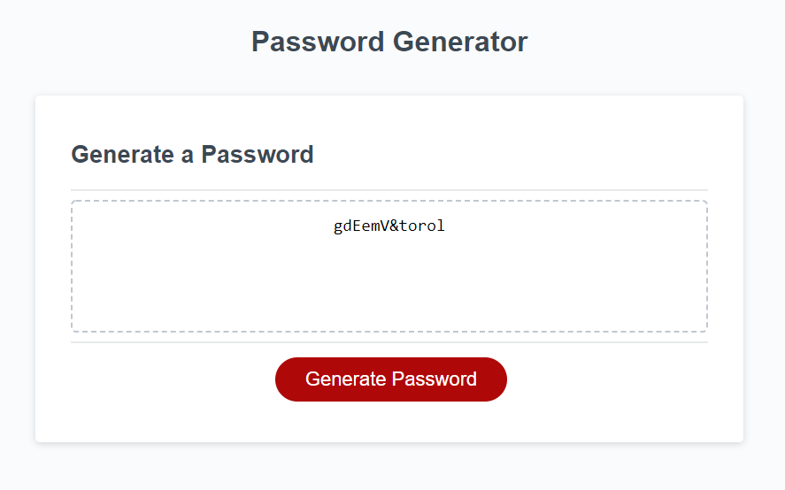

# Week 3 Homework: Password Generator

## My Objective:
* Modify starter code to creat a password generator

* Make sure the looks stays clean and polished after modifications are complete

* Make sure that the generated password meets the criteria that was selected in the prompts

* Set up alerts if the prompts are not answered correctly

* Make sure the user can choose from uppercase letters, lowercase letters, numbers, and special characters

* Make sure that the customer can choose the length of the password but give a minumin and maximum length the customer MUST stay inside of

* Once all of the criteria has been choosen the generator should give the customer the random password
---

## What Does The User Want

```
The user wants to be able to randomly generate a password that meets certain criteria. This will allow the user to creat a strong password that provides greater security.
```

---
## Below is an example of a password generated with 12 characters including uppercase letters, lowercase letters, numbers, and special characters:



---
## Links For Refrence:

[Webpage where the password generator can be found](https://carletta88.github.io/homework3/)

[Link to responsitory with the html, css, and javascript](https://github.com/Carletta88/homework3)


